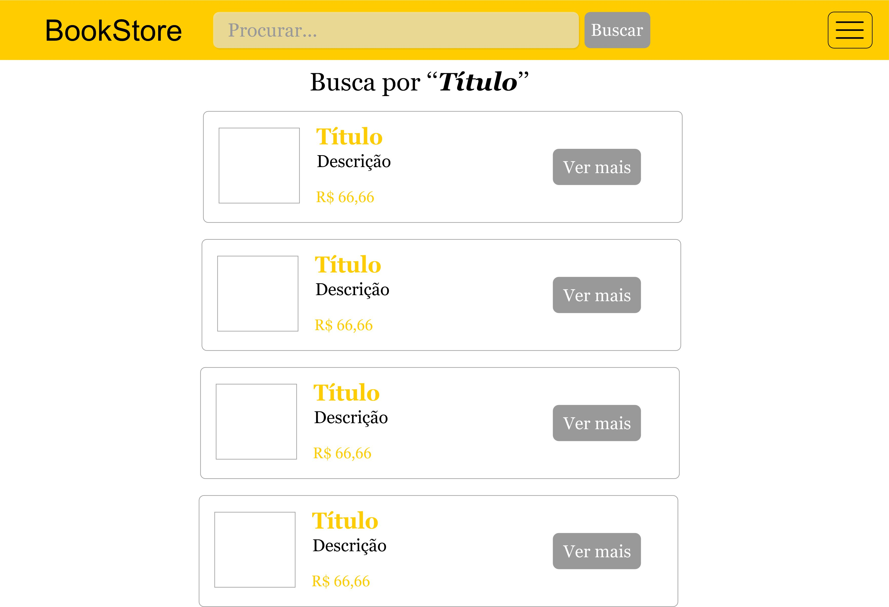
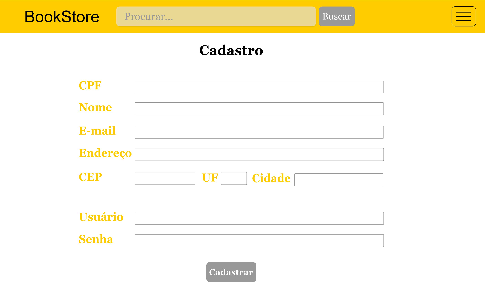
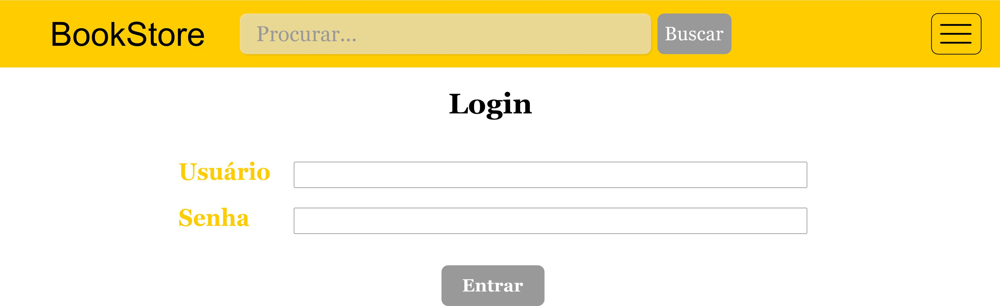

# **CSI606-2021-02 - Remoto - Proposta de Trabalho Final**

## *Aluna(o): Nicole da Silva Pedrosa*

--------------

<!-- Descrever um resumo sobre o trabalho. -->

### Resumo

  O sistema de livraria online proporciona ao usuário um catálogo de livros sem a necessidade de sair de casa. Um dos pontos principais desse tipo de sistema é proporcionar comodidade ao cliente, onde ele possa pesquisar por diversos livros e receber o produto no conforto de sua casa.
  As principais funcionalidades são a busca pelo título ou autor do livro, exibição de detalhes e preços, além de um carrinho de compras para visualizar quais os livros escolhidos e finalizar a compra.

<!-- Apresentar o tema. -->
### 1. Tema

  O trabalho final tem como tema o desenvolvimento de um sistema de livraria online.

<!-- Descrever e limitar o escopo da aplicação. -->
### 2. Escopo

  Este projeto terá as seguintes funcionalidades:

      - Buscar livros por título;
      - Fazer cadastro e login;
      - Ver descrição de cada título;
      - Adicionar item no carrinho de compras;
      - Finalizar compra.
  

<!-- Apresentar restrições de funcionalidades e de escopo. -->
### 3. Restrições

  Neste trabalho não serão considerados:
      - Títulos com escrita errada;
      - Finalizar compra com cartão de crédito;
      ...

<!-- Construir alguns protótipos para a aplicação, disponibilizá-los no Github e descrever o que foi considerado. //-->
### 4. Protótipo

  Protótipos para as páginas: Homepage, busca, cadastro, login e carrinho de compras foram elaborados, e podem ser encontradas em:

Home Page: é a página inicial do site, onde encontramos os livros mais vendidos, novidades e recomendações.

Procurar: retorna o resultado da busca feita pelo título do livro.

Cadastrar: página para fazer o cadastro do usuário para finalizar a compra.

Login: página que o usuário entra na sua conta para adicionar livros ao carrinho e fazer o pagamento.

s
Carrinho de Compras: onde o usuário encontra os produtos escolhidos e também o preço final para finalizar a compra.

### 5. Referências

  Referências podem ser incluídas, caso necessário. Utilize o padrão ABNT.
